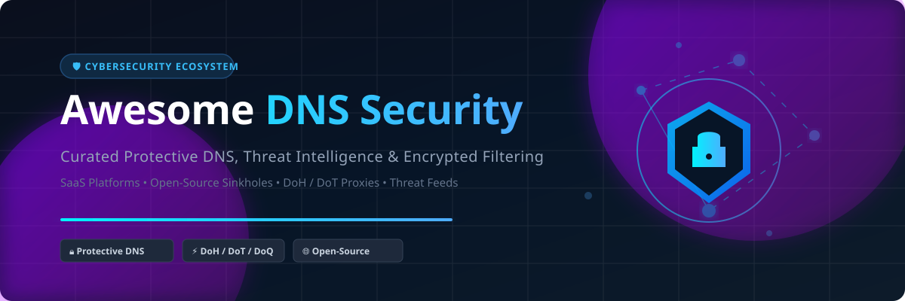

  

  
  
  
  
  

---

# 🛡️ Awesome DNS Security

> **A curated, comprehensive ecosystem of Protective DNS (PDNS), Threat Intelligence Feeds, Encrypted DNS Filtering (DoH / DoT / DoQ), and Open-Source DNS Sinkholes.**

Welcome to the definitive guide on **DNS Security**, **Protective DNS (PDNS)**, **DNS Firewalls**, and **Encrypted DNS Filtering**. Domain Name System (DNS) is the foundational layer of internet traffic, making it a primary vector for cyber threats including DNS tunneling, data exfiltration, malware Command & Control (C2), phishing, and Ransomware-as-a-Service (RaaS).

This repository indexes the leading enterprise **SaaS protective DNS platforms** alongside high-performance **open-source DNS resolvers, sinkholes, and proxies** for enterprise security operation centers (SOCs), MSPs, network administrators, privacy advocates, and homelab enthusiasts.

---

## 📑 Table of Contents

- [📊 Market Overview & Industry Analysis](#-market-overview--industry-analysis)
- [🏢 SaaS & Hosted Enterprise Platforms](#-saas--hosted-enterprise-platforms)
- [💻 Open-Source GitHub Projects](#-open-source-github-projects)
- [🤝 How to Contribute](#-how-to-contribute)
- [📈 Star History](#-star-history)
- [💖 Support & Sponsorship](#-support--sponsorship)
- [⚠️ Disclaimer](#%EF%B8%8F-disclaimer)

---

## 📊 Market Overview & Industry Analysis

### 💡 Estimated Sector Market Size
The global **Protective DNS & DNS Security Market** is estimated at **~$2.1 Billion** in 2026 and is projected to expand at a **Compound Annual Growth Rate (CAGR) of 15.2%** to exceed **$4.5 Billion by 2030**. Growth is driven by zero-trust architecture adoption, CISA/NSA Protective DNS mandates for government contractors, and escalating DNS-based malware attacks.

### 🧩 Market Dynamics & Fragmentation
The DNS security market is **moderately fragmented**. Rather than being a strictly "winner-take-all" market, the landscape is partitioned across distinct customer segments:
- **Enterprise Network & SASE Leaders**: *Cisco Umbrella, Cloudflare Gateway, Infoblox, IBM NS1* dominate large-scale enterprise deployments requiring unified Zero Trust SASE and DDI (DNS/DHCP/IPAM) integration.
- **Mid-Market & MSP Specialists**: *DNSFilter, Control D, WebTitan* compete aggressively on rapid deployment, AI-driven real-time domain classification, and multi-tenant MSP dashboards.
- **Privacy & Self-Hosted Ecosystem**: *Pi-hole, AdGuard Home, Blocky, Technitium* command massive grassroots adoption among privacy-conscious home labs and SMBs seeking complete data sovereignty and zero vendor lock-in.

---

## 🏢 SaaS & Hosted Enterprise Platforms

The table below summarizes commercial Protective DNS (PDNS) platforms, sorted by **Company Size / Valuation (Descending)**, complete with starting pricing tiers and free trial limits.

| Platform / Product | Company Size / Valuation | Starting Tier Pricing | Free Tier / Free Trial Limit | Key Features & Highlights |
| :--- | :--- | :--- | :--- | :--- |
| **[Cisco Umbrella](https://umbrella.cisco.com/)** 🛡️ | ~$425B Market Cap ($56.65B Revenue) | $1,960.08/year ($163.34/month for DNS Essentials 100-pack) or $5.00/user/month | 14-day free trial (up to 1,000 users/devices) | Cloud-delivered security platform enforcing policy at DNS & IP layers. Trusted by 100M+ users with 100% DNS service uptime, domain reputation scoring, and Cisco SIG integration. |
| **[NS1 (IBM NS1 Connect)](https://ns1.com/)** 🌐 | ~$210B Market Cap ($62.0B Revenue) | $100.00/month (NS1 Essentials package) | 30-day free trial (full DNS routing & traffic steering functionality) | Intelligent DNS with DDoS resilience across 26 global PoPs, 100% uptime SLA, NS1 Trex™ near line-rate Qname attack filtering, and DNSSEC signing. |
| **[Cloudflare Gateway](https://www.cloudflare.com/zero-trust/products/gateway/)** ⚡ | ~$125B Market Cap ($2.17B Revenue) | $0.00/month (Free Tier); Paid tiers start at $7.00/user/month | Free forever for up to 50 users (Cloudflare Zero Trust free plan) | Zero Trust DNS filtering part of Cloudflare One. Enforces security threat categories (malware, phishing, C2), acceptable use policies, and optional TLS decryption. |
| **[DNS Made Easy](https://dnsmadeeasy.com/)** 🚀 | ~$8.0B Valuation ($500M Revenue) | $50.00/month (Business plan; entry tiers from $14.50/month) | 30-day free trial (full enterprise DNS management features) | Enterprise DNS with proprietary Real-Time Traffic Anomaly Detection (RTTAD) using ML to spot DDoS. Operates on AS16552 with true 100% uptime SLA. |
| **[Infoblox BloxOne Threat Defense](https://www.infoblox.com/)** 🔒 | ~$3.4B Valuation ($1.0B ARR) | $1,500.00/year (~$125.00/month token-based starting baseline) | 30-day free trial (via cloud test drive & hands-on lab access) | Protective DNS with threat intelligence feeds, DNS firewall, and Zero-Day DNS detection. Blocks domains within 1–2 minutes of registration to stop aging malicious domains. |
| **[BlueCat](https://bluecatnetworks.com/)** 🏰 | ~$1.8B Valuation (~$100M+ Revenue) | $500.00/month (Enterprise subscription baseline quote) | 30-day free trial (VM download for LiveAssurance / Horizon test drive) | Unified DDI (DNS, DHCP, IPAM) with optional Threat Protection add-on. Features hub-and-spoke architecture for enterprise DNS server management and DGA/tunneling protection. |
| **[WebTitan](https://www.titanhq.com/)** 🛡️ | ~$200M Valuation (~$30M Revenue) | $0.40/user/month ($240.00/year minimum contract) | 14-day free trial (full web & DNS filtering for unlimited test users) | DNS filtering and web security for businesses and MSPs. Effective category-based web filtering blocking malicious and inappropriate domains. |
| **[DNSFilter](https://www.dnsfilter.com/)** 🎯 | ~$150M Valuation ($62M Funding, ~$40M Revenue) | $1.00/user/month ($240.00/year minimum contract for Basic plan) | 14-day free trial (no credit card required) | Protective DNS and content filtering for enterprises, MSPs, and schools. Real-time threat detection, DoT, PreCheck analytics, Entra ID integration, and MCP connector. |
| **[Control D](https://controld.com/)** 🎛️ | ~$20M Valuation (~$5M Revenue) | $2.00/endpoint/month (or $20.00/year personal plan) | 14-day free trial (full access to custom rules, profiles & proxy locations) | Cloud-based DNS control panel offering granular per-device profiles, app blocking, domain redirection/spoofing, scheduled policies, and 100+ proxy exit locations. |

---

## 💻 Open-Source GitHub Projects

Below is the curated selection of open-source DNS sinkholes, resolvers, proxies, and blocklists sorted by **GitHub Star Count (Descending)**.

- **[Pi-hole](https://github.com/pi-hole/pi-hole)**  🍓  
  The de facto standard open-source network-wide ad and tracker-blocking DNS sinkhole. Runs on Raspberry Pi or any Linux environment, protecting all network devices without per-client software. Features web management console, DHCP server, DoH integration, and custom blocklist management.

- **[AdGuard Home](https://github.com/AdguardTeam/AdGuardHome)**  🏠  
  Open-source network-wide DNS filtering server with a modern dashboard. Supports DoT, DoH, DoQ, and DNSCrypt out of the box, per-client configuration rules, parental controls, safe search enforcement, and cross-platform Docker / binary deployment.

- **[HaGeZi's DNS Blocklists](https://github.com/hagezi/dns-blocklists)**  🧹  
  Extensive, daily-updated collection of high-purity DNS blocklists engineered to prevent ad tracking, malware, phishing, telemetry, and scam domains without breaking clean internet functionality. Compatible with Pi-hole, AdGuard Home, Unbound, and Blocky.

- **[CoreDNS](https://github.com/coredns/coredns)**  ⚙️  
  Flexible, extensible DNS server written in Go that chains plugins to perform service discovery, custom rewriting, metrics generation, and DNSSEC validation. The default DNS engine for Kubernetes clusters worldwide.

- **[DNSCrypt-proxy](https://github.com/DNSCrypt/dnscrypt-proxy)**  🔐  
  Flexible command-line DNS proxy supporting encrypted DNS protocols including DNSCrypt v2, Anonymized DNSCrypt, DNS-over-HTTPS (DoH), and Oblivious DoH (ODoH). Provides local query blocking, domain cloaking, and query logging.

- **[SmartDNS](https://github.com/pymumu/smartdns)**  ⚡  
  Local DNS server that queries multiple upstream DNS servers concurrently and returns the fastest IP address result. Features domain blocking, DoH/DoT upstream proxying, and geo-DNS optimization for ultra-low latency lookups.

- **[miekg/dns](https://github.com/miekg/dns)**  🛠️  
  Complete, high-performance DNS library in Go supporting all standard RR types, DNSSEC signing, TSIG validation, and server building blocks. Trusted foundation behind CoreDNS and custom DNS microservices.

- **[Blocky](https://github.com/0xERR0R/blocky)**  🧱  
  Fast, lightweight DNS proxy and ad-blocker written in Go. Supports DoH/DoT upstreams, per-client blocklist grouping, Prometheus metrics, query logging, and low memory consumption in Docker containers.

- **[Unbound](https://github.com/NLnetLabs/unbound)**  🌲  
  Validating, recursive, caching DNS resolver built by NLnet Labs. Serves as the security baseline for self-hosted DNS infrastructure, performing full cryptographic DNSSEC validation and root server recursion.

- **[NextDNS CLI](https://github.com/nextdns/nextdns)**  📲  
  Lightweight client for NextDNS that runs on routers and endpoints. Enables encrypted DNS-over-HTTPS (DoH) with per-device identification, local hostname resolution, and cloud-configured content filtering.

- **[Technitium DNS Server](https://github.com/TechnitiumSoftware/DnsServer)**  🎛️  
  Self-hosted cross-platform DNS server featuring a rich web console, authoritative/recursive modes, built-in ad blocking, DoH/DoT/DoQ, clustering, and advanced DNS application plugins. Serves 100,000+ QPS.

- **[PowerDNS](https://github.com/PowerDNS/pdns)**  ⚡  
  Enterprise-grade high-performance DNS server suite providing Authoritative Server and DNS Recursor modules. Supports backend databases (MySQL, PostgreSQL), Lua scripting for dynamic policy enforcement, and RPZ threat feed ingestion.

- **[ZDNS](https://github.com/zmap/zdns)**  🔬  
  High-speed CLI DNS lookup tool written in Go by the ZMap team. Designed for security research, mass domain resolution, threat intelligence extraction, and high-throughput network measurement.

- **[qdm12/dns](https://github.com/qdm12/dns)**  🐳  
  Containerized DNS-over-TLS/HTTPS proxy and resolver with built-in blocklists for malicious hosts, ads, and telemetry. Built with LRU caching, Prometheus metrics, and custom allow/block CIDRs.

---

## 🤝 How to Contribute

Contributions are warmly welcomed! Please follow these guidelines:

1. Fork this repository.
2. Add your product or project entry to `README.md` following the tabular or list format.
3. Ensure description details are factual, concise, and unbiased.
4. Open a Pull Request (PR) with a brief summary of the addition.

---

## 📈 Star History

---

## 💖 Support & Sponsorship

If you find **Awesome DNS Security** helpful for your security operations, homelab, or research, please consider supporting the project:

- ⭐ **Star this repository** to help others discover it!
- 🍴 **Fork it** to customize your own DNS security workflow.
- 📢 **Share it** with network engineers, security analysts, and tech communities.
- ☕ **Sponsor / Buy me a coffee**: Support ongoing open-source curation via the [GitHub Sponsor Dashboard](https://github.com/sponsors/ishandutta2007).

---

## ⚠️ Disclaimer

- This is a **community-curated index** for informational and educational purposes only — not an endorsement of any vendor or tool.
- Deployment of DNS filtering, payload inspection, or network monitoring must strictly comply with local regulatory frameworks and privacy laws.
- Self-hosted DNS filtering requires regular maintenance of blocklists and upstream resolvers to prevent false positives and operational disruption.

---

  <b>Built for Network Engineers, SOC Analysts, Privacy Advocates, and Self-Hosters worldwide.</b> 
  <i>Let's make DNS security transparent, user-controlled, and accessible to everyone.</i>

